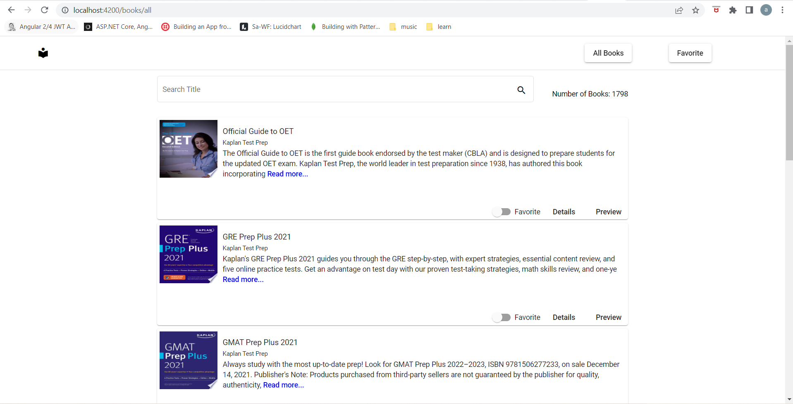
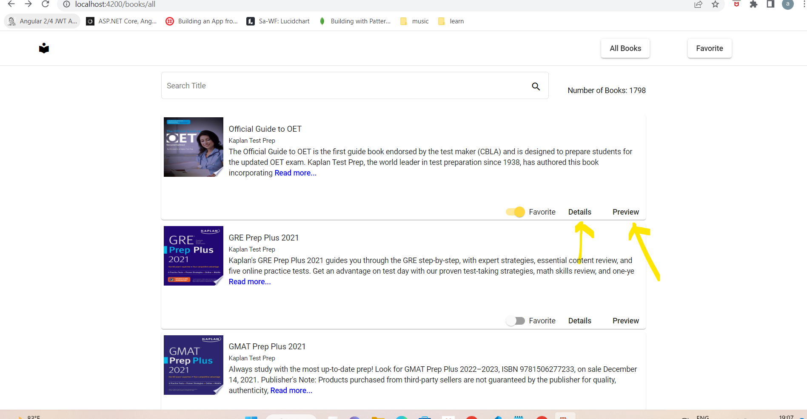
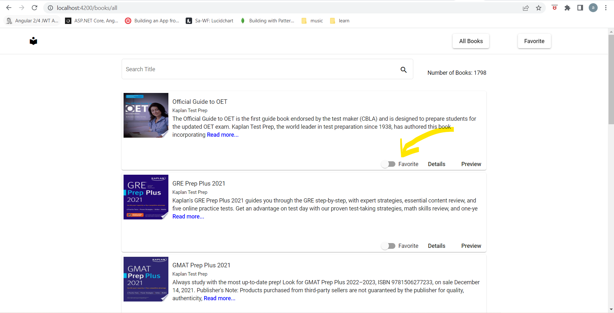
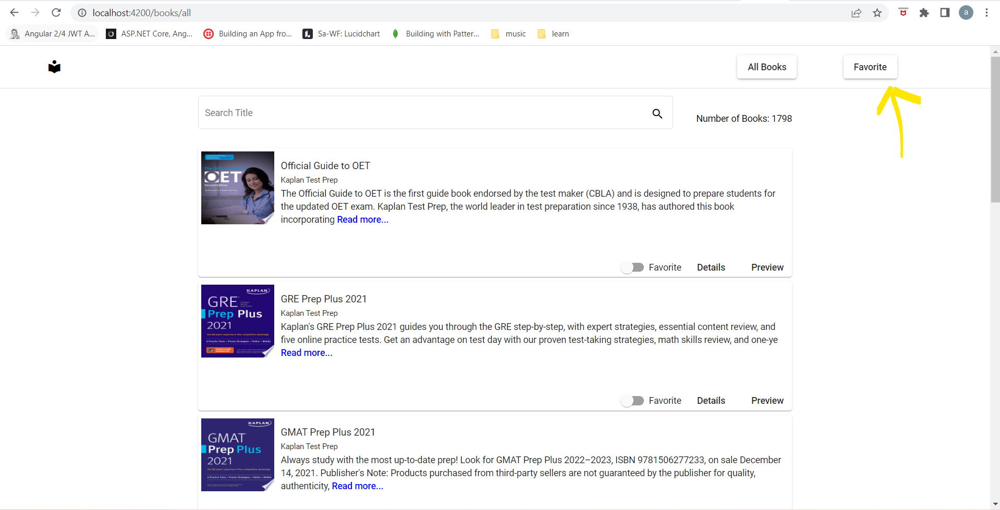
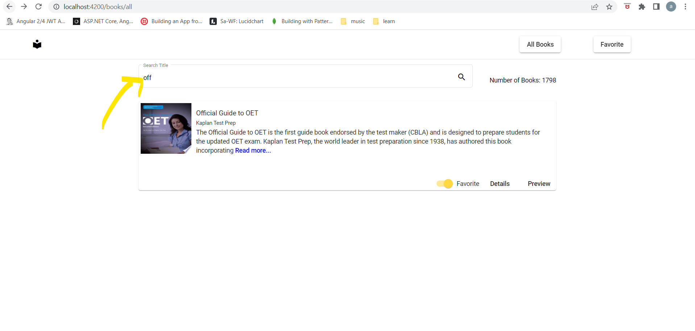
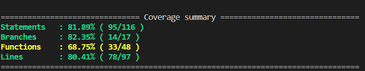

# UI

This project was generated with [Angular CLI](https://github.com/angular/angular-cli) version 13.3.0.

Please make sure Node version v16.10.0. is installed.

After cloning the repo please run `npm install` all the packages

Please make sure all the packages are installed successfully.

Note: If commands of  `ng` for example  `ng serve` does not work then run it prefixing `npx` example `npx ng serve`

## Development server

Run `ng serve` for a dev server. Navigate to `http://localhost:4200/`. The application will automatically reload if you change any of the source files.

## Build

Run `ng build` to build the project. The build artifacts will be stored in the `dist/` directory.

## Running unit tests

Run `ng test` to execute the unit tests via [Karma](https://karma-runner.github.io).

## Screens

Below is the image of list page which display all the books.

Click the details and preview buttons to check the screens (details page only displays raw data)

You can add the books to favorite list as shown below

Once you added books to favorite list navigate to favorite screen to see the favorites.

You can search the books based on book title in both the pages.

Technical details:
Used Lazy loading module.
Created custom pipe for filter.
Ngrx for state management.
Angular material for UI components.
Jasmine for unit testing.
Added snack bar component to display error.

Below is the screen shot of code coverage report.

